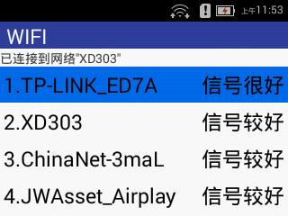

### 网络配置步骤

1.在主菜单页面选择【4.设置】；

2.在【管理员密码认证】页面输入授权密码，授权密码默认为数字123456，并按【确认】 按钮；

3.在【设置】界面可以选择【2.WIFI】， 进入WIFI列表显示界面，如下图：

            图 3-1 WIFI列表显示界面

用户可根据实际情况，使用"向上"按钮或"向下"按钮选择将要连接的WIFI热点名称，
按【确认】键进入【选取网络】界面，输入此WIFI热点的密码，若WIFI密码包含字母，则使用"向上"按钮进行切换，
例如：若WIFI密码包含字母”z”，则首先按下包含改字母的数字键"1"，之后按下"向上"按钮，
 显示区会显示"Q"，连续按下"向上"按钮，直到显示区显示字母"z"为止，其他字母的输入方式以此类推；

4.在【设置】界面也可以选择【3.移动数据】进行数据连接上网

