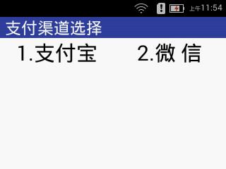

###终端交易流程（C扫B）

1.在主菜单页面选择【5.消费】；

2.、在【被扫支付】页面输入金额，并按【确认】按钮，即进入【支付渠道选择】页面；

            图 7-1 支付渠道选择页面

3. 以”支付宝” 为例，在【支付渠道选择】界面选择【1.支付宝】， 进入“待支付”界面，如下图：

               图 7-2 待支付界面

顾客使用”支付宝”客户端”扫一扫”扫码界面，扫描上述”待支付”界面的二维码，由顾客”支付宝”客户端完成支付交易流程；

